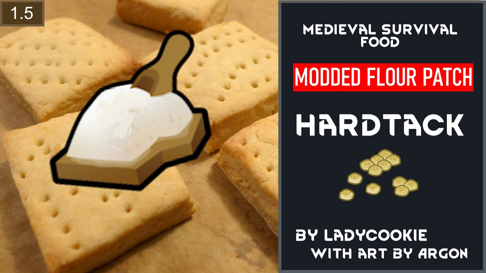

# Hardtack Flour Patch

An XML patch for LYN's hardtack mod to make it compatible with added flours from various mods. Existing recipes to bake hardtack now accept flour from supported mods, if they are installed.

### Supported Mods
* [Vanilla Cooking Expanded](https://steamcommunity.com/sharedfiles/filedetails/?id=2134308519)
* [Smokeleaf Industry Reborn](https://steamcommunity.com/sharedfiles/filedetails/?id=2018570327)

### Credits
**LadyCookie** for graciously extending free permission to modify their mods.

**Smash Phil** for their wondrous tool *Xml Patch Helper*.

Steam Download: https://steamcommunity.com/profiles/76561198878117463/myworkshopfiles/?appid=294100
